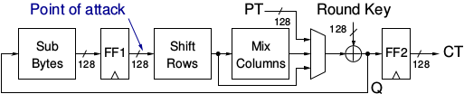
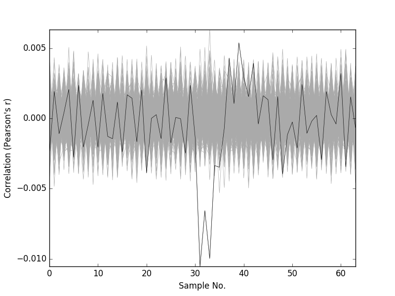
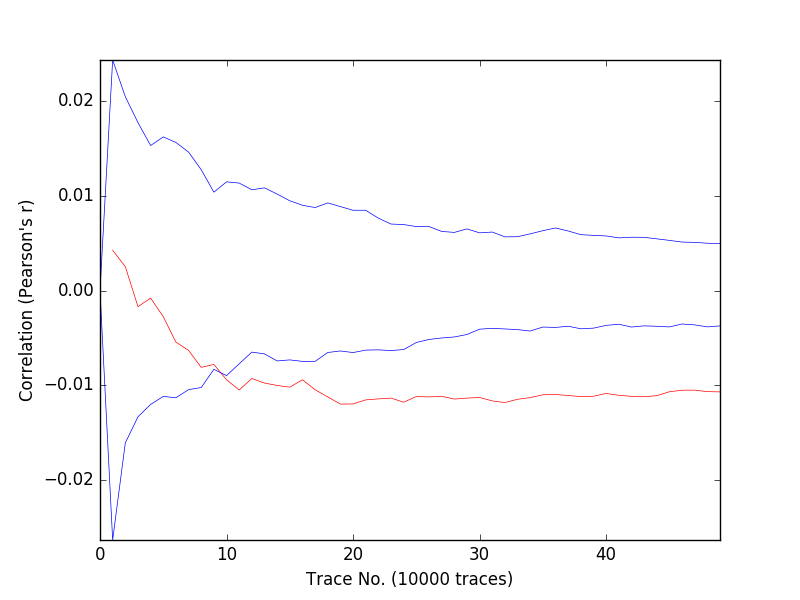

AES CPA Example
***************

This section describes a Correlation Power Analysis (CPA) attack of an implementation of the
Advanced Encryption Standard (AES) using FOBOS. AES is an symmetric-key cipher used ex-
tensively in security sensitive applications world wide. AES applies four different transformations,
SubBytes, ShiftRows, MixColumns, and AddRoundKey, per round and iterates through several
such rounds depending upon the key size. An intermediate key called ”round key” is generated and
used per round which is derived from the original key through a reversible key scheduling function.
We have implemented a basic iterative architecture of AES with 128-bit key length and 128-bit
wide datapath requiring 11 clock cycles for one encryption. Key scheduling is done on-the-fly and
the SubBytes function is realized through look-up-tables. The block diagram for this design is
shown in the figure below:

   AES-128 implementation

We attack our AES design during the first round at the output of the register FF1 (see the figure above). The equation for calculating the Hamming Distance (HD) is shown in the eqation below. We use
Pearson’s Correlation to correlate the instantaneous power consumption with the HD model.

    H(i,j) = HD(SBOX(CT(i) ), SBOX(kguess(j) xor PT(i+1) ))

For trace collection, we used the Basys3 control board and connected a NewAE CW305 DUT (Artix7 FPGA).
The DUT clock was set to 1 MHz and the oscilloscope sampling rate was set to 62 M Sample/sec.
We then collected 500K traces.
The formula above was used to generate the hypothetical power matrix.

Below is the script used for the CPA analysis. This script is at fobos/software/cpaExample.py and the example files are 
stored in fobos/workspace/aes_artix7_picoscope :

.. code-block::
    :linenos:
    
    import os
    import numpy as np
    import fobos.traceset as traceset
    import fobos.cpa as cpa
    import fobos.postprocess as postprocess
    import fobos.projmgr as projmgr
    import fobos.powermodels.AESFirstLast as powermodel

    def main():
        # Configure project directories################################
        WORKSPACE = "../workspace/aes_artix7_picoscope/capture"
        PROJECT_NAME = "aes_artix_pico_62MSps"
        pm = projmgr.ProjectManager()
        pm.setWorkSpaceDir(WORKSPACE)
        pm.setProjName(PROJECT_NAME)
        projDir = pm.getProjDir()
        analysisDir = pm.getAnalysisDir()
        ######
        TRACES_FILE = os.path.join(projDir, 'powerTraces.npy')
        PLAIN_FILE = os.path.join(projDir, 'plaintext.txt')
        CIPHER_FILE = os.path.join(projDir, 'ciphertext.txt')
        HYPO_FILE = os.path.join(projDir, "hypotheticalPower.npy")

        CROP_START = 218
        CROP_END = 282

        NUM_TRACES = 220000
        MTD_STRIDE = 10000
        traceSet = traceset.TraceSet(traceNum=NUM_TRACES,
                                    fileName=TRACES_FILE,
                                    cropStart=CROP_START,
                                    cropEnd=CROP_END)

        measuredPower = traceSet.traces
        hypotheticalPower = powermodel.getHypotheticalPower(PLAIN_FILE,
                                                            CIPHER_FILE,
                                                            NUM_TRACES)
        # hypotheticalPower = np.load(HYPO_FILE)
        cpaAttacker = cpa.CPA()
        C = cpaAttacker.doCPA(measuredPower=measuredPower,
                            hypotheticalPower=hypotheticalPower,
                            numTraces=NUM_TRACES,
                            analysisDir=analysisDir,
                            MTDStride=MTD_STRIDE
                            )

    if __name__ == '__main__':
        main()

In line 7 we import the power model module that will calcualte the hypothetical power matrix.
This module was used in line 35. 
After we set the directories and specify input files, we set CROP_START and CROP_END which 
selects the first round of the encryption in the power trace.
We set the number of traces to be used in the attack using NUM_TRACES variable and set the step 
used in plotting the MTD graph using the variable MTD stride.

Once all setting are complete, we call the doCPA() method in line 40. This method takes the measuredPower matrix,
the hypotheticalPower matrix, the number of traces, the directory used to store results and the MTD stride.

Below, we show the correlation graph and the MTD graph for the first byte of the key.

   CPA Correlation for key byte-0

   CPA MTD graph for key byte-0