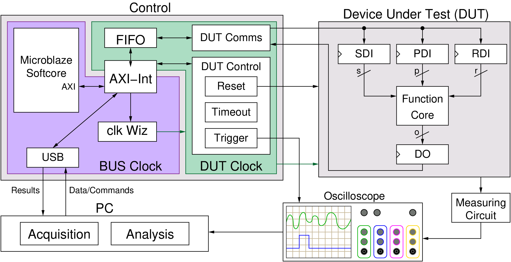

Data Acquisition - Processing Data
**********************************
After test vectors have been generated, user can run dataAcquisition.py. The PC will send one test vector at a time to the control board, which sends it to DUT. The control board will trigger the oscilloscope to capture the trace. The process will be repeated until all traces are collected.
 
FOBOS control-DUT protocol
--------------------------

The control board receives test vectors from the PC one at a time. Then, it sends the vector to the DUT which uses the header information in the vector to put the data (plaintext, key etc.) into the correct FIFOs. The DUT wrapper then allows the victim algorithm to run by setting the victim reset to zero. The victim then drains the FIFOs (sdi and pdi FIFOs) and stores the output in the dout FIFO. Once the dout FIFO accumulates the expected amount of data, the DUT wrapper sends data to the controller which sends it to the PC.

The following diagram shows the components of FOBOS including the handshake signals used.

   FOBOS2 Block Diagram

A Basic Example
---------------

Below, we show an example of using the controller internal test feature. When enabled, the controller process the data and echo back the
PDI without sending the data to the DUT.

.. code-block::
   :linenos:

    import fobos
    # Constants###########################################################
    SERIAL_PORT = '/dev/ttyUSB2'
    TRACE_NUM = 5
    OUT_LEN = 7
    # Instantiate FOBOS objects###########################################
    print("Sending configuration...")
    ctrl = fobos.Basys3Ctrl(SERIAL_PORT)
    ctrl.enableTestMode()
    ctrl.setOutLen(OUT_LEN)
    # Run DUT operations
    testVectors = ['00c0000761996dc996d4ac00c100070f7821507a22a00081000700800001',
                   '00c00007fd8771fe717de400c100073e1fe5b4aa357c0081000700800001',
                   '00c0000782051f5484702200c10007980d05d4ea25bc0081000700800001',
                   '00c0000767881b702afe5200c10007b08a5e036de72b0081000700800001',
                   '00c0000726a1d601ccdf7a00c1000773539e52672d5d0081000700800001']

    print 'Sending data..'
    traceNum = 0
    while traceNum < TRACE_NUM:
        data = testVectors[traceNum]
        status, result = ctrl.processData(data, OUT_LEN)
        if status != fobos.OK:
            print "TIMEOUT"
        print(result)
        traceNum += 1

If you run the code above, the control board will echo the PDI as shown below.

.. code-block::
    
    $ python dummyCaptureBasic.py 
    Sending configuration...
    f0030006000900000001
    Status= 00000000
    f0030006000000000007
    Status= 00000000
    Sending data..
    f001001e00c0000761996dc996d4ac00c100070f7821507a22a00081000700800001
    OK.    Status= 00000000
    61 99 6d c9 96 d4 ac
    f001001e00c00007fd8771fe717de400c100073e1fe5b4aa357c0081000700800001
    OK.    Status= 00000000
    fd 87 71 fe 71 7d e4
    f001001e00c0000782051f5484702200c10007980d05d4ea25bc0081000700800001
    OK.    Status= 00000000
    82 05 1f 54 84 70 22
    f001001e00c0000767881b702afe5200c10007b08a5e036de72b0081000700800001
    OK.    Status= 00000000
    67 88 1b 70 2a fe 52
    f001001e00c0000726a1d601ccdf7a00c1000773539e52672d5d0081000700800001
    OK.    Status= 00000000
    26 a1 d6 01 cc df 7a

An Extended Example
-------------------

The following example shows how to test the conteroller using the internal test feature. However, this time
we show more features like setting the DUT clock and timeout etc.

.. code-block::
   :linenos:

    import os
    import shutil
    import fobos
    # Constants###########################################################
    WORKSPACE = "/nhome/aabdulga/fobosworkspace"
    PROJECT_NAME = "test"
    DIN_FILE_NAME = "dinFile.txt"
    CIPHER_FILE = "ciphertext.txt"
    TRACE_FILE = "powerTraces.npy"
    DUT_BIT_FILE = "FOBOS_DUT.bit"
    SERIAL_PORT = '/dev/ttyUSB1'
    TRACE_NUM = 5
    DUT_CLk = 1
    OUT_LEN = 7
    TIMEOUT = 5
    TRIG_WAIT = 1
    TRIG_LENGTH = 1
    TRIG_MODE_NORM = 0
    TRIG_MODE_FULL = 1
    TIME_TO_RST = 0
    # Instantiate FOBOS objects###########################################
    ctrl = fobos.Basys3Ctrl(SERIAL_PORT)
    ctrl.setDUTClk(DUT_CLk)
    ctrl.enableTestMode()
    ctrl.setTimeToReset(TIME_TO_RST)
    ctrl.setOutLen(OUT_LEN)
    ctrl.setTimeout(TIMEOUT)
    ctrl.setTriggerWait(TRIG_WAIT)
    ctrl.setTriggerLen(TRIG_LENGTH)
    ctrl.setTriggerMode(TRIG_MODE_FULL)

    # Configure project directories#########################################
    pm = fobos.ProjectManager()
    pm.setWorkSpaceDir(WORKSPACE)
    pm.setProjName(PROJECT_NAME)
    projDir = pm.getProjDir()

    tvFileName = os.path.join(projDir, DIN_FILE_NAME)
    tvFile = open(tvFileName, "r")
    captureDir = pm.getCaptureDir()
    cipherFileName = os.path.join(captureDir, CIPHER_FILE)
    cipherFile = open(cipherFileName, "w")
    shutil.copy(tvFileName, captureDir)
    # Get traces############################################################
    print 'Sending data..'
    traceNum = 0
    while traceNum < TRACE_NUM:
        data = tvFile.readline()
        status, result = ctrl.processData(data, OUT_LEN)
        if status != fobos:
            print "TIMEOUT"
        print(result)
        cipherFile.write(result + "\n")
        traceNum += 1

    tvFile.close()
    cipherFile.close()

This script connects to the Basys3 controller, configure the controller and then prepares the input and output files.
Once this setup is done, the script reads the input test vector file and sends one line at a time to the controller to process it.
The controller sends the data to the DUT (in this example we use the internal dummy DUT).

Here is a line by line description of the code.
lines 1-3 imports packages the we will need in the code. The fobos package is the package we need to have access to the classes we need to communicate 
with the controller and other useful tools.

Lines 22-30 configures the controller. we set the following parameters

- The DUT clock frequency is set to 1 MHz. This is the clock generated by the control board and used to clock the DUT.
- Test mode is enabled. In this mode, the controller uses its internal dummy DUT to process data. This DUT simply echoes PDI.
- Time-to-reset is set to 0. This disables this feature. If set to a number greater than zero, the DUT will be reset after 
  that number of clock cycles.
- The controller timeout is set to 5 seconds. The control board will wait for 5 seconds for the DUT to respond before giving up.
- The trigger mode is set to Normal mode, trigger wait cycles to 1 and trigger length to 1. For more information about he trigger module,
  please refer to [ref trigger]

Lines 33-43 configures the workspace. The ProjectManager class is used to setup a simple directory structure to store input and output files.
Each run of this scripts creates a new directory to store the output files.
This script expects all data to be in WORKSPACE/PROJECT_NAME directory (created by the user). The user should also put the test vector file
'dinFile.txt' that directory. All results will be saved in the WORKSPACE/PROJECT_NAME/Capture. A new directory will be created for each new run.
Also, different files are specified relative to the project directory.

Lines 46-56 reads the test vector file one line at a time and sends it to the control board which processes it and sends back the result.
