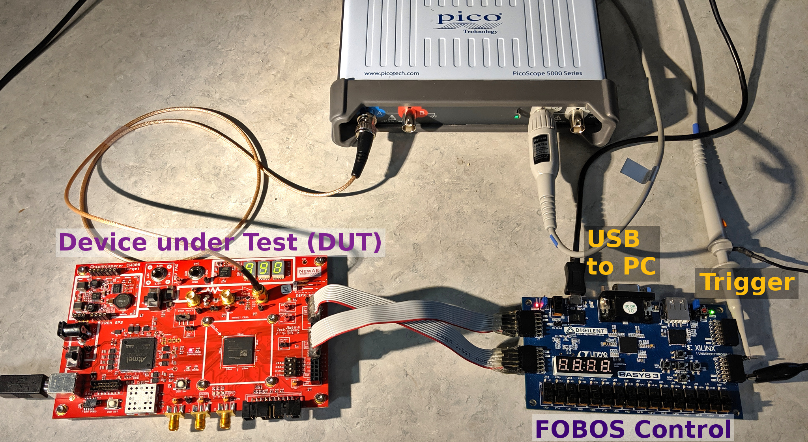
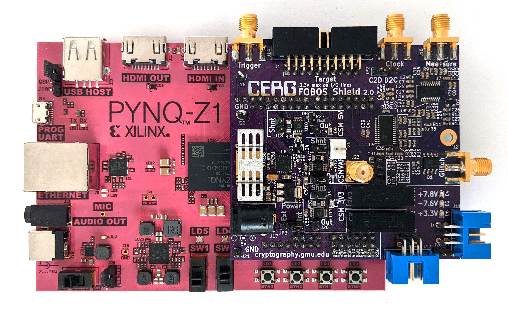

.. _control-setup-label:

*************
FOBOS Control
*************
FOBOS supports two boards for FOBOS Control:

#. Digilent Basys 3
#. Digilent Pynq-Z1

The main differences are:

**Basys 3:**

   Typical FOBOS3 Setup with Basys 3

- Connected via USB2 to the SCA workstation
- Less expensive that Pynq-Z1
- Requires oscilloscope

  :doc:`setup_basys3`

**Pynq-Z1:**

   Typical FOBOS3 Setup with Pynq-Z1 (needs new picture)

- Connected via gigabit Ethernet -> much faster communication to the SCA workstation
- Supports oscilloscope
- Supports FOBOS Shield which enables:
    - Standard ChipWhisperer DUT connector
    - DUT clock aligned measurements using built-in OpenADC
    - Power consumption measurements for benchmarking
    - Variable voltage output (0.9V - 3.5V)
    - Crowbar glitching
    - Isolated power supply for linear and differential amplifiers

  :doc:`setup_pynq`

.. toctree::
   :hidden:
   
   setup_basys3
   setup_pynq

