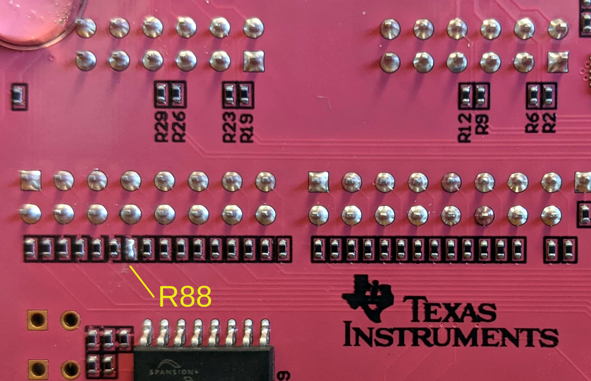

.. _control-pynq-setup-label:

Pynq-Z1 Setup
==============================
Below, we describe how to setup FOBOS 3.0 on the Pynq-Z1 board. 

Requirements
------------

#. A PC with Linux installed.
#. Python3 is installed.
#. Xilinx Vivado 2020.2 is in the search path.
#. FOBOS 3 is downloaded and unpacked on the PC (see :ref:`fobos-pc-install`).
#. Digilent Pynq-Z1 board (control board) and the SCA Workstation are connected via Ethernet 
    and you can reach the Pynq board from the PC using ``ssh``.

Control Board Setup
-------------------

Follow these steps to compile the control software, generate the bitstream and program 
the control board.

**1. Build the Pynq Overlay**

    The creation of the Pynq Overlay file for FOBOS is completely scripted and can be accomplished in just a few steps. Make sure ``vivado`` version 2020.2 is in the search path.
    
    #. ``cd fobos/sources/pynq_controller/vivado/``
    #. ``make create_project``
    #. ``make synth``
    #. Go and make yourself a cup of coffee or tea, this is going to take a while.
    #. When Vivado is done, you will have the files pynq_ctrl.bit and pynq_ctrl.hwh in this directory.

**2. Preparing the Control Board**

    The next step is to get the FOBOS software and the newly created overlay onto the Pynq Board.

    #. Copy the ``fobos/software`` directory to the ``/home/xilinx/`` directory on the Pynq board 
       using scp or sftp.
    #. Copy the files ``pynq_ctrl.bit`` and ``pynq_ctrl.hwh`` from ``fobos/sources/pynq_controller/vivado`` 
       to your Pynq board into the ``/home/xilinx/fobos/software/`` directory.
    #. Use ssh to get a comand prompt on the Pynq board, change directory to the ``fobos/software`` 
       directory and run the script sudo ``./install-pynq.sh``. 
       It will ask you several questions about your Pynq setup, install the necessary files, and 
       start the pynqserver.

**3. Modifying the Pynq Board**

    In order to use the FOBOS Shield, a small modification has to be made to the Pynq board. 
    On the Pynq board, the 200 Ohm resistor R88 in the line IO29 of the ADC clock has to be 
    removed and replaced with a blob of solder. The resistor attenuates the ADC clock signal too much.
    The removed resistor is shown in (:numref:`fig_pynq_modification`).

.. _fig_pynq_modification:

   Modifications to Pynq-Z1 for FOBOS Shield

Testing the Control Board
-------------------------
