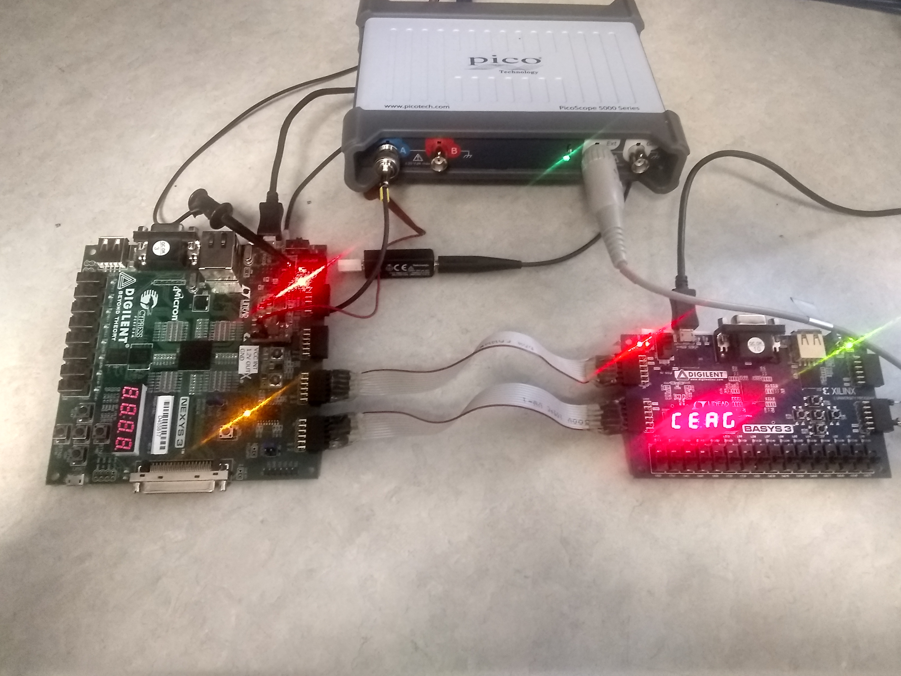

.. FOBOS documentation master file, created by
   sphinx-quickstart on Fri Aug 30 16:09:53 2019.
   You can adapt this file completely to your liking, but it should at least
   contain the root `toctree` directive.

Flexible Opensource workBench fOr Side-channel analysis (FOBOS)
***************************************************************

The Flexible Opensource workBench fOr Side-channel analysis FOBOS is a platform to perform side-channel analysis (SCA).
FOBOS uses commercially avilable boards when possible to reduce the cost of building a working SCA setup.
Using FOBOS, power traces can be collected and attacks like Correlation Power Analysis (CPA) can be mounted.
Also, scripts to perform leakage assesment are included.

   Typical FOBOS2 Setup

Features
========
- Run cryptographic implementations on FPGAs and measurse power consumption.
- Uses commercially available FPGA boards.
- Separate control and Device Under Test (DUT) boards.
- Supports fast USB3-base oscilloscope (Picoscope).
- Support Digilient Basys3 control board.
- Supports Digilent Nexys3 (Spartan6 FPGA) and NewAE CW305 (Artix7 FPGA).
- Analysis software to perform Correlation Power Analysis (CPA).
- Leakage assesment using TVLA and Chi-squared test. 

.. toctree::
   :maxdepth: 2
   :hidden:

   
   introduction
   setup
   tvgen
   dut_board_setup
   dutdev
   capture_data
   capture_scope
   controller_features
   cpa
   aes_cpa_example
   t_test
   reference_doc
   license

Indices and tables
==================

* :ref:`genindex`
* :ref:`search`
