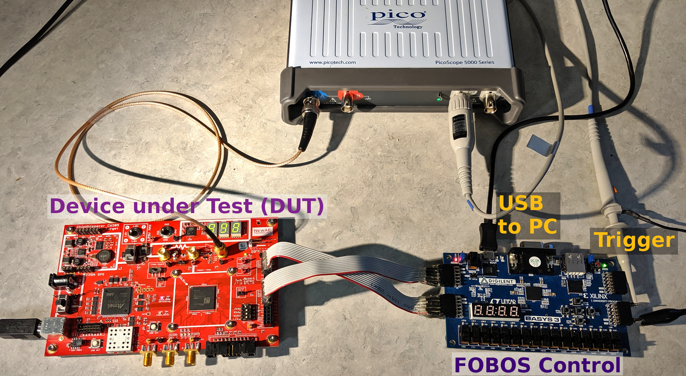

Introduction
************
The Flexible Opensource workBench fOr Sidechannel analysis (FOBOS) is a platform that
can be used for side channel analysis.
You can perform trace collection (Data Acquisition) and attacks (Data Analysis).
The system is suitable for educational and research purposes.

   FOBOS Typical Setup

Feature Overview
================

- Separate control and (Design Under Test) boards allowing addition of new DUTs easily.
- Uses commercial over-the-shelf boards when possible to reduce cost.
- Digilent Basys3 and Nexys A7 control boards.
- DUT support includes Digilent Nexys3 board (Xilinx Spartan6) and compatible with NewAE CW305
  (Xilinx Artix7 boards).
- Adjustable DUT clock.
- Adjustable trigger signal.
- Software to perform Correlation Power Analysis (CPA).
- Leakage assessment using t-test and chi-squared test.

