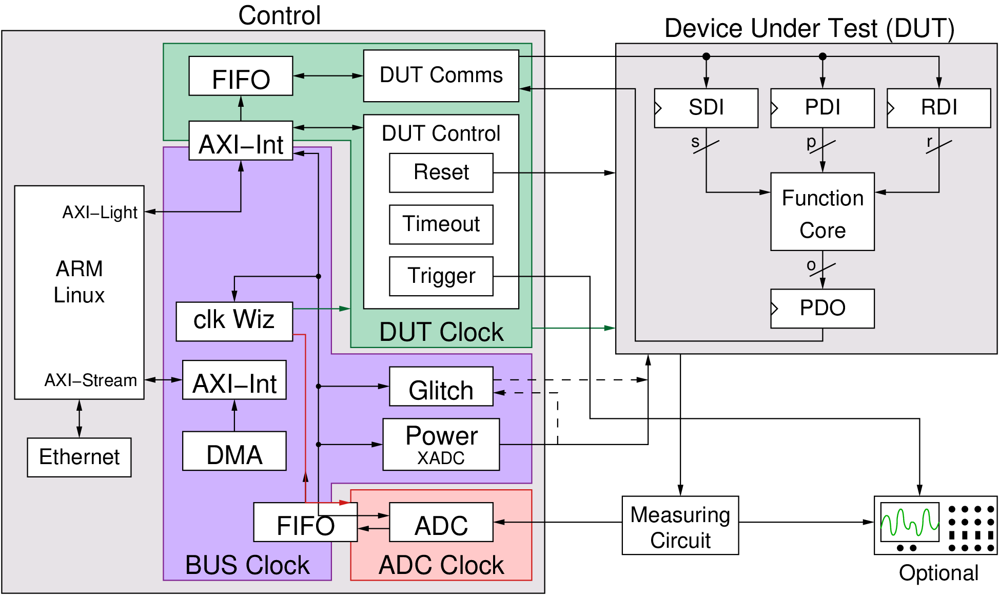

.. _modules-label:

*************
FOBOS Modules
*************
FOBOS supports two boards for FOBOS Control:

#. Digilent Basys 3
#. Digilent Pynq-Z1

Each has its own set of modules. 

**Basys 3:**

.. figure::  ../figures/fobos2-block.png
   :align:   center
   :scale:   30%

   Block Diagram of FOBOS with Basys 3 as control board

Here is a list of the available modules:

- :ref:`dut_comms-label` including *DUT Interface*, *Output Length*
- :ref:`dut_control-label` including *DUT Clock*, *DUT Selection*, *Trigger*, *Reset*, *Timeout*, *Glitch*  and *DUT Working Counter*

**Pynq-Z1:**

   Block Diagram of FOBOS with Pynq-Z1 as control board

Here is a list of the available modules:

- :ref:`dut_comms-label` including *DUT Interface*, *Output Length*
- :ref:`dut_control-label` including *DUT Clock*, *DUT Selection*, *Trigger*, *Reset*, *Timeout*, *Glitch*  and *DUT Working Counter*
- :ref:`openADC-label` (requires FOBOS Shield)
- :ref:`power-label` (requires FOBOS Shield)

.. toctree::
   :hidden:
   
   dut_comms
   dut_control
   openadc
   power

