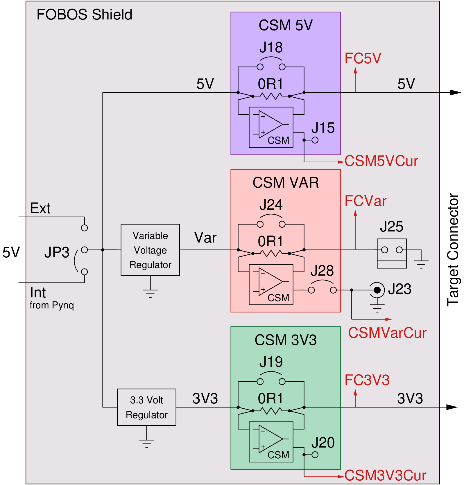

.. _power-label:

Power Module
************

The power module requires the FOBOS Shield. It contains tree power supplies:

- Fixed, unregulated 5V power supply (FC_5V), up to 1A
- Fixed, regulated 3.3V power supply (FC_3V3), up to 800mA
- Variable supply (FC_VAR), programmable from 0.9V to 3.5V in 0.5V increments, up to 1A

The circuit of these power supplies is shown in (:numref:`fig_power_circuit`).

.. _fig_power_circuit:

   Block Diagram of FOBOS Shield Power Circuitry

.. _power_pynq-label:

Powering Pynq and FOBOS Shield
==============================

Pynq with the FOBOS Shield has to be powered with a power supply. This combination will 
draw more power than the Pynq's USB port can provide. There are two options to provide
this power:

#.  External power for the Pynq

    -   In this configuration, the external power supply powers both, the Pynq and the FOBOS Shield power module.
    -   Connect a 7V-15V, 2A-3A power supply to the Pynq to the power jack (J18) of the Pynq-Z1.  
        The supply must use a center-positive 2.1mm barrel plug.
    -   Set the jumper JP5 on the Pynq-Z1 to "REG". 
    -   Set the jumper JP3 on the FOBOS Shield to "Int".
    -   **NOTE:** In this configuration, not more than a total of 1A should be drawn across all three power 
        supplies of the shield or the 5V regulator of the Pynq will be overloaded.

#.  External power of the FOBOS Shield

    -   In this configuration, the external power supply powers only the FOBOS Shield power module.
    -   Connect a **well regulated** 5V, 2A-3A power supply to the power jack (J17) of FOBOS Shield.  
        The supply must use a center-positive 2.1mm barrel plug.
    -   Set the jumper JP3 on the FOBOS Shield to "Int".
    -   **NOTE:** In this configuration, the 5V power supply (FC_5V) is not regulated and the actual voltage 
        depends solely on the external supply.

Power Module Specifications
============================

TODO: talk about XADC precision and speed

Power Module Callibration
=========================

TODO

Measuring Power Supply Voltage
==============================

FOBOS uses the XADC of the Zynq SOC on the Pynq to measure the voltages of the three power supplies. 
They can be accessed with the following commands:

.. code-block:: python

    ctrl.pwGetVolt5v()
    ctrl.pwGetVoltVar()
    ctrl.pwGetVolt3v3()

Measuring Power Supply Current
==============================

- CSM
- Gain settings
- error based on gain (INA255 datasheet)
- commands

Hardware and Software Trigger
=============================

- Why trigger
- Overflow
- Measurement Count
- Commands

Average and Maximum Voltages and Currents
=========================================
