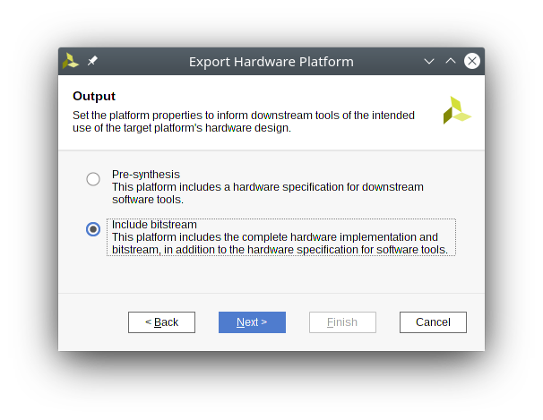
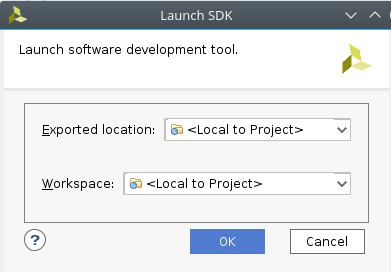
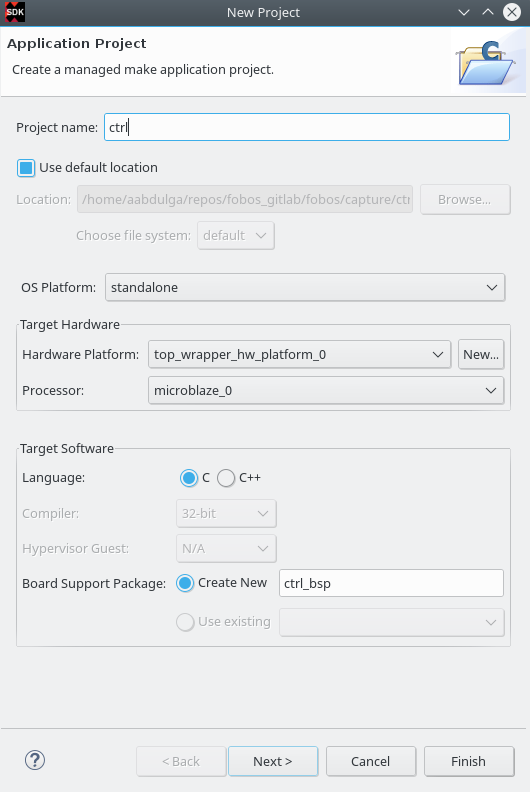

Setup
***********
Below, we describe how to setup FOBOS 2.0 hardware and software and test that everything is working.
This page only describes setting up the control board and software for acquisition and anlysis. 
For DUT board please refer to :ref:`dut_board_setup-label`.

Requirements
============
1. Digilent Basys3 board (control board).
2. A PC with Linux installed.
3. Python2.7 installed.
4. Xilinx Vivado 2017.2.
5. Picoscope 5000 series.

Software Setup
==============

Note: The following installation procedure is tested on Linux Ubuntu 16.04.

1. Download FOBOS from the `FOBOS home page <https://cryptography.gmu.edu/fobos/getfobos.php>`_.
2. Extract the archive into the directory of your choice

.. code-block:: bash

    $ tar xvfz fobos-v2.0.tgz

3. Use the following commands to install pip and few necessary Python packages:

.. code-block::

    $ sudo apt-get install python-pip
    $ tar xvfz fobos-v2.0.tgz
    $ pip isnatll -r requirements.txt

Control board Setup
===================

Follow these steps to compile the control software, generate the bitstream and program 
the the control board.

1. Build the control board Vivado project.

.. code-block:: bash

    $ cd fobos/capture/ctrl/basys3ctrl/vivado
    $ make project

2. A Vivado project will be created at fobos/capture/ctrl/basys3ctrl/vivado/basys3ctrl. Open it using Vivado.

.. figure::  figures/open_project.png
   :align:   center

   Open Vivado project

3. In Vivado's Flow Navigator window, click 'Generate Bitstream'.
4. After bitstream is generated, export the hardware. Click File > Export > Export Hardware ... make sure to select 'Include bitstream'.

   Export Hardware

5. Launch the Xilinx SDK (File > Launch SDK).

   Launch SDK

6. In the SDK, create a new empty project(File> New application project). Set the project name to *ctrl* and select
the hardware platform, click Next and make sure you select 'Empty project'.

   Create Project

7. Link all the .c and .h files in the fobos/capture/ctrl/basys3ctrl/sdk/src/ to the project 
   (right-click on ctrl/src folder -> Import -> General-> file system -> browse to folder). 
   make sure to check "Advanced-> Create links in the workspace" and "Create virtual folders" .

.. figure::  figures/import_sdk_src.png
   :align:   center

   Launch SDK

8. Program the control borad FPGA. Connect the Basys3 board to your PC via USB. In the Xilinx Tools menu, select Program FPGA -> program.

9. Run the control software. Make sure to select the *ctrl* project created in step 6 then go to the Run menu and select 'Run'.
10. You should see the word CERG in the seven-segment display of the Basys3 board.

..  Information for flash programming TODO

    8. Right-click on the project you just created and select Build Configurations > Set Active > Release. Then right-click again and select Build Project.

    9. Make sure that there are no debug flags. Right-click the release folder under the project and select Properties. In the window that appears
    select C/C++ Build > Settings > Microblaze gcc Compiler > Debugging and set Debug Level to 'None'.

    .. figure::  figures/release_settings.png
    :align:   center

    Remove Debugging

    Now the SDK generates an elf file for the controller software in fobos/capture/ctrl/basys3ctrl/vivado/basys3ctrl/basys3ctrl.sdk/ctrl/Release/.

    10. Go back to Vivado > IP Integrator > Open Block Design.

    11. Right-click on the Microblaze processor and select 'Associate ELF Files...'. Browse to the ctrl.elf file generated by the SDK.

    .. figure::  figures/release_settings.png
    :align:   center

    Associate ELF File

    12. Click Generate Bitstream.

    13. After the bitstream is generated, click Open Hardware Manager > Open Target > Auto Connect.

    14. Add the configuration memory device. In the Hardware window, right-click on the FPGA device and select 'Add Configuration Memory Device ...'.
    In the search area enter s25fl032p-spi-x1_x2_x4 and select the Spansion spi memory.

    14. Under the Hardware window, right-click on the memory device and select 'Program Configuration Memory Device'

    .. figure::  figures/program_mem.png
    :align:   center

    Configuration Memory

    15. In the window that appears, browse to the .bin file PATH and select Erase, Program and Verify.

    .. figure::  figures/basys3_program_flash.png
    :align:   center

    Program Configuration Memory

    16. Now, power cycle your Basys3 board and your controller is ready to use!

Testing the control board
=========================

To make sure the control board is working, you can run the *dymmyCaptureBasic.py* script in the fobos/software directory.
This script send data to the board wich echos data back.

.. code-block::
    
    $ cd path-to-fobos/software
    $ python dummyCaptureBasic.py 
    Sending configuration...
    f0030006000900000001
    Status= 00000000
    f0030006000000000007
    Status= 00000000
    Sending data..
    f001001e00c0000761996dc996d4ac00c100070f7821507a22a00081000700800001
    OK.    Status= 00000000
    61 99 6d c9 96 d4 ac
    f001001e00c00007fd8771fe717de400c100073e1fe5b4aa357c0081000700800001
    OK.    Status= 00000000
    fd 87 71 fe 71 7d e4
    f001001e00c0000782051f5484702200c10007980d05d4ea25bc0081000700800001
    OK.    Status= 00000000
    82 05 1f 54 84 70 22
    f001001e00c0000767881b702afe5200c10007b08a5e036de72b0081000700800001
    OK.    Status= 00000000
    67 88 1b 70 2a fe 52
    f001001e00c0000726a1d601ccdf7a00c1000773539e52672d5d0081000700800001
    OK.    Status= 00000000
    26 a1 d6 01 cc df 7a

If you see this output, your control board is now ready!