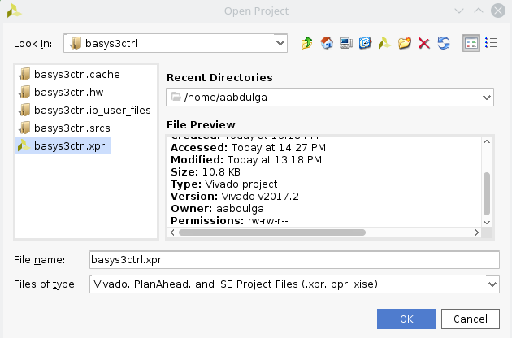
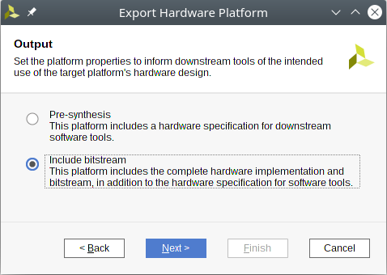
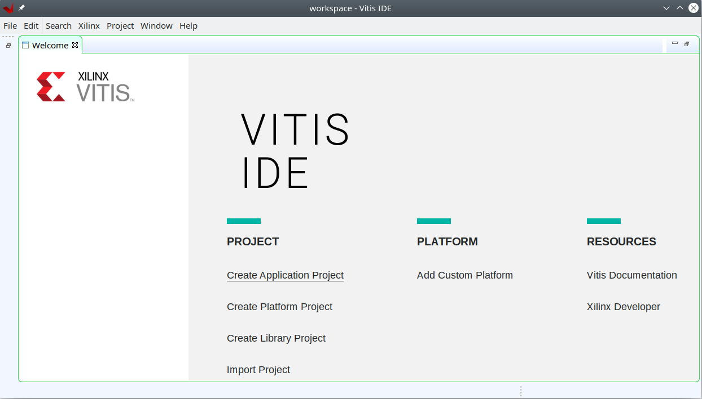

.. _control-basys3-setup-label:

FOBOS Control on Basys 3 Setup
***********
Below, we describe how to setup FOBOS 3.0 on the Basys 3 board. 

Requirements
============
1. A PC with Linux installed.
1. Python3 is installed.
1. Xilinx Vivado 2020.2 is in the search path.
1. FOBOS 3 is downloaded and unpacked on the PC (see :ref:`fobos-pc-install`).
1. Digilent Basys3 board (control board) is connected to the PC.

Control board Setup
===================

Follow these steps to compile the control software, generate the bitstream and program 
the control board.

1. Build the control board Vivado project.

.. code-block:: bash

    $ cd fobos/control/basys3ctrl/vivado
    $ make create_project

2. A Vivado project will be created at fobos/control/basys3ctrl/vivado/basys3ctrl. Open it using Vivado.

   Open Vivado project

3. In Vivado's Flow Navigator window, click 'Generate Bitstream'.

   
4. After bitstream is generated, export the hardware. Click File > Export > Export Hardware ... make sure to select the 'Include bitstream' option. Then press 'Next' until this process is finished.

   Export Hardware

5. Launch Xilinx Vitis (Tools > Launch Vitis IDE). This tool will create a workspace when you start it for the first time. Then a welcome screen will be displayed where you have to select 'Create Application Project'.

   Launch Vitis

6. Next, Vitis will ask you to select a hardware platform. Choose the 'Create a new platform from hardware (XSA)' tab and 'Browse...' to the xsa file that was created by Vivado when you exported the hardware. It should be `fobos/control/basys3ctrl/vivado/basys3ctrl/top_wrapper.xsa`.

   Vitis Select Platform

7. Set the project name to *ctrl* and click Next.

   Vitis New Project

8. Click Next again.

   Vitis New Project 2

9. Select the 'Empty Application' template.

   Vitis Empty Application

10. Link all the .c and .h files in the `fobos/control/basys3ctrl/sdk/src/` folder to the project. 
   Right-click on the 'ctrl' folder in the left panel and select 'Import Sources ...'.  
   Browse to the folder and make sure to check "Advanced-> Create links in the workspace" and "Create virtual folders" .

   Vitis Import Sources

11. Program the control board FPGA. Connect the Basys3 board to your PC via USB. In the 'Xilinx' menu, select 'Program Device'.
   Make sure the correct device is selected and then click on *Program*. If you have multiple boards connected to your PC, the 'Auto Detect' will likely fail and you have to specify the board manually. 

12. Right-click on the 'ctrl' folder in the left panel and select 'Build Project' 

13. Right-click on the 'ctrl' folder in the left panel and select 'Run As -> 1 Launch on Hardware'. If you have multiple boards connected to your PC this will most likely fail. You would have to select 'Run As -> Run Configurations...'. Double click on 'Single Application Debug', select the 'Target Setup' tab and manually select the 'PL Device'. 

14. You should see the word CERG in the seven-segment display of the Basys3 board.

Storing the bitstream on a flash drive
=====================================
To avoid opening Vitis every time you switch-on the Basys 3 board to program it, you can save the bitstream to a
flash drive and the board will use it to program the FPGA when power is turned on.
To do this, follow these few steps.

1. In Vivado, open the block design of the control board (IP Integrator -> Open Block Design).

2. Right-click on the Microblaze processor and select 'Associate ELF Files ...'.

3. In the window that appear, click the '...' button associated with Design Sources and locate the ELF file created using the SDK (it should be located at *fobos/control/basys3ctrl/vivado/basys3ctrl/basys3ctrl.sdk/ctrl/Debug/*) and the name of the file is *ctrl.elf*.

4. Generate the bitstream.

5. Copy the bitstream from *fobos/control/basys3ctrl/vivado/basys3ctrl/basys3ctrl.runs/impl_1/top_wrapper.bit* to a flash drive formatted with FAT32 file system (it must be the only .bit file in the root directory of the flash drive).

6. Connect your flash drive to the Basys3 board. Make sure that the *mode* jumper in the Basys3 board is set to the USB setting.

7. Power cycle your Basys3 board and it will load the bitstream. The word 'CERG' is displayed in the 7-segment display indicating the board is ready.

..  Information for flash programming TODO

    8. Right-click on the project you just created and select Build Configurations > Set Active > Release. Then right-click again and select Build Project.

    9. Make sure that there are no debug flags. Right-click the release folder under the project and select Properties. In the window that appears
    select C/C++ Build > Settings > Microblaze gcc Compiler > Debugging and set Debug Level to 'None'.

    .. figure::  figures/release_settings.png
    :align:   center

    Remove Debugging

    Now the SDK generates an elf file for the controller software in fobos/capture/ctrl/basys3ctrl/vivado/basys3ctrl/basys3ctrl.sdk/ctrl/Release/.

    10. Go back to Vivado > IP Integrator > Open Block Design.

    11. Right-click on the Microblaze processor and select 'Associate ELF Files...'. Browse to the ctrl.elf file generated by the SDK.

    .. figure::  figures/release_settings.png
    :align:   center

    Associate ELF File

    12. Click Generate Bitstream.

    13. After the bitstream is generated, click Open Hardware Manager > Open Target > Auto Connect.

    14. Add the configuration memory device. In the Hardware window, right-click on the FPGA device and select 'Add Configuration Memory Device ...'.
    In the search area enter s25fl032p-spi-x1_x2_x4 and select the Spansion spi memory.

    14. Under the Hardware window, right-click on the memory device and select 'Program Configuration Memory Device'

    .. figure::  figures/program_mem.png
    :align:   center

    Configuration Memory

    15. In the window that appears, browse to the .bin file PATH and select Erase, Program and Verify.

    .. figure::  figures/basys3_program_flash.png
    :align:   center

    Program Configuration Memory

    16. Now, power cycle your Basys3 board and your controller is ready to use!

Testing the control board
=========================

To make sure the control board is working, you can run the *dymmyCaptureBasic.py* script in the fobos/software/examples directory.
This script send data to the board which echos data back.

.. code-block:: bash
    
    $ cd path-to-fobos/software/examples
    $ python3 dummyCaptureBasic.py 
    Sending configuration...
    f0020002000a
    OK.    Status= 00000000
    22334455
    Detected fobos2 control board! Device file = /dev/ttyUSB1
    f0020002000a
    OK.    Status= 00000000
    22334455
    f0030006000900000001
    Status= 00000000
    f0030006000000000007
    Status= 00000000
    Sending data..
    f001001e00c0000761996dc996d4ac00c100070f7821507a22a00081000700800001
    OK.    Status= 00000000
    00 c0 00 07 61 99 6d
    f001001e00c00007fd8771fe717de400c100073e1fe5b4aa357c0081000700800001
    OK.    Status= 00000000
    00 c0 00 07 fd 87 71
    f001001e00c0000782051f5484702200c10007980d05d4ea25bc0081000700800001
    OK.    Status= 00000000
    00 c0 00 07 82 05 1f
    f001001e00c0000767881b702afe5200c10007b08a5e036de72b0081000700800001
    OK.    Status= 00000000
    00 c0 00 07 67 88 1b
    f001001e00c0000726a1d601ccdf7a00c1000773539e52672d5d0081000700800001
    OK.    Status= 00000000
    00 c0 00 07 26 a1 d6

If you see this output, your control board is now ready!
