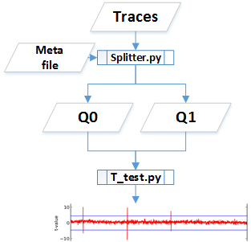
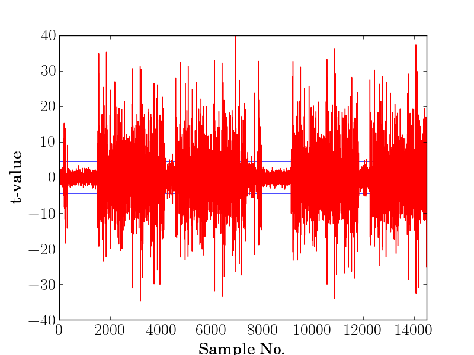
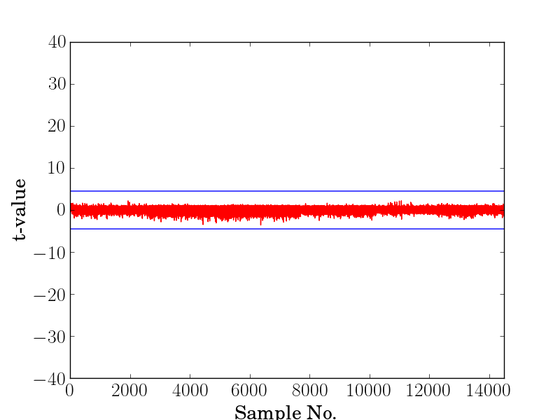

T-test Leakage Assessment
*************************

T-test Flow
-----------
Welch’s T-test is used as a tool for leakage assessment. This guide describes using FOBOS to perform a fixed-vs-random t-test.

To perform a t-test you need to generate test-vectors that interleaves fixed and random traces.
FOBOS data acquisition is run to get the traces, then the traces are splitted into two sets and the statistical Welch's t-test is performed.

   T test flow

Test vector generation
----------------------

The user generates the test-vector file and a meta file that specifies which test vectors are random and which are fixed.
Fixed-vs-random t-test uses interleaved fixed and random test vectors. We can select a fixed test vector D and create a set of test vectors that  interleaves D and a randomly selected test vector. The interleaving is random.
For example the following test vector can be used to perform a t-test on an algorithm implemented on FOBOS DUT.

.. code-block:: none
    :emphasize-lines: 1,4,6,7

    00C001607000000020000000D600000CB0B1B2B3B4B ...
    00C001607000000020000000D600000C0EEB8882501 ...
    00C001607000000020000000D600000CF402296C454 ...
    00C001607000000020000000D600000CB0B1B2B3B4B ...
    00C001607000000020000000D600000CE919E2FC539 ...
    00C001607000000020000000D600000CB0B1B2B3B4B ...
    00C001607000000020000000D600000CB0B1B2B3B4B ...
    .
    .

The corresponding fvrchoicefile specifies which traces are random '1' and which are fixed '0'.
For example the fvrchoicefile that corresponds to the test-vectors above is

.. code-block:: none

    0110100 ...

See :ref:`tvgen-label` for more information.

Peforming a t-test
------------------
Once traces have been collected, scripts are used to perform the t-test.

1- Copy the *cleanTraces.py*, *splitter.py* and *t-test2.py*  scipts from fobos/software/tools/t-test to the locatation where you have the power 
traces you collected.

2- Make sure you have your trace file named *powerTraces.npy* and your fvr choice file named *fvrchoicefile.txt*. 
These files need to be at the same directory as the scripts copied in step 1.

3- Convert the power traces format using the read_traces.py. Blow, you can find the parameters used with this script.

.. code-block:: bash

    $ python read_traces.py -h
    ###### readtraces.py script
    usage: read_traces.py [-h] source_file destination_file num_of_traces

    positional arguments:
    source_file       Traces from FOBOS dataAcquisition
    destination_file  .npy file that store traces as MxN Nupmy array.
    num_of_traces     .npy file that store traces as MxN Nupmy array.

    optional arguments:
    -h, --help        show this help message and exit

For exmple, the following command takes the powerTraces.npy file and coverts it to cleanTraces.npy and it uses only the
first 2000 traces. 

.. code-block:: bash
    
    python read_traces.py powerTraces.npy cleanTraces.npy 2000

4-  Next, we split the cleanTraces.npy file into two trace files

- *traces0.npy* for the traces that came from the fixed test vector
- *traces1.npy* for traces that came from using the random test vectors.

To do this, splitter.py needs the fvrchoicefile.txt file. It also needs to know how many traces to consider.
These are configurable parameters in the script. Here is all the parameters you can edit in splitter.py:

.. code-block:: python

    ######Parameters
    MAX_TRACE=2000
    traces0File = 'traces0.npy'
    traces1File = 'traces1.npy'
    fvrFile = 'fvrchoicefile.txt'
    cleanTraceFile = 'cleanTraces.npy'
    ##########################

Once you configure the parameters, you can run splitter using:

.. code-block:: bash
    
    python splitter.py 

The reuslt will be 2 files called traces0.npy and traces1.npy.

5- The two files are now ready to be fed into the *t-test2.py* script to perform the t-test. Here are the parameters that this script needs:

.. code-block:: bash

    $ python t-test2.py -h
    usage: t-test2.py [-h] trace_file0 trace_file1 plot_file

    positional arguments:
    trace_file0  .npy file that store traces as MxN Nupmy array
    trace_file1  .npy file that store traces as MxN Nupmy array
    plot_file    File name to store the output figure

    optional arguments:
    -h, --help   show this help message and exit

Before running the script, also edit the plotting parameters in the script. These parameters specify the limits on the x and y axis.

.. code-block:: python

    # Parameters ########
    start_ylim = -40
    end_ylim = 40
    start_xlim = 0
    end_xlim = 1000
    #####################

This limits the t-values to -40-40 and displays samples from 0 to 1000 on the x-axis.

Once you configure all the parameters, you can run the t-test using the following command.

.. code-block:: bash

    python t-test2.py traces0.npy traces1.npy result_t_test.png

The output will be a file called result_t_test.png that shows the t-values on the y-axis and samples in the x-axis.
Here is sample file that shows a failing test and a successful one:

   T test on an unprotected AES-GCM implementation.

   
   T test on a protected AES-GCM implementation.
