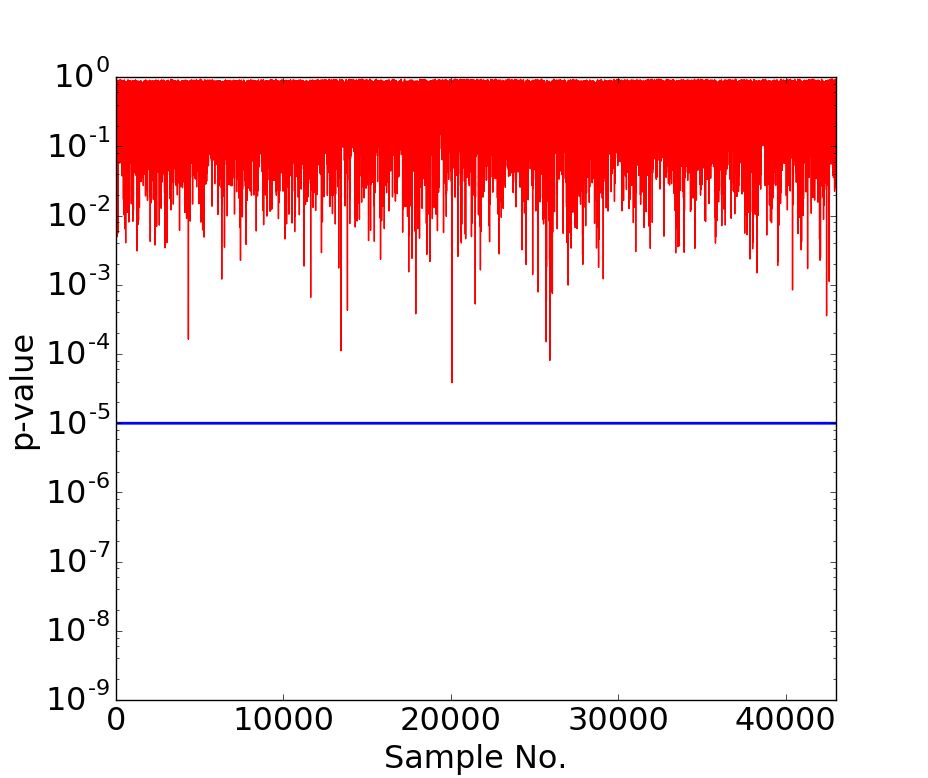

Chi-Squared Test Leakage Assessment
***********************************

The chi-squared test can be used with the t-test to assess leakage.
The chi-squared script that is provided uses 'random' and 'fixed' classes so the inputs 
to the script are the same as the ones used for t-test2.py. For more information, please refer
to the T-test page.
The script is named x-test3.py and is located in fobos/software/tools/x-test.
To run the test, use the following command. 

.. code-block:: bash

    python x-test3.py traces0.npy traces1.npy result_x_test.png

Where all the input files are similar to the t-test inputs.

Below, we show a chi-sqaured test that show a leakage and one that does not. In these two graphs we 
choose a threshold of 10^-5 and reason that the implementation is leaking if p-values are below the threshold.

   Chi-squared test on Unprotected Ascon

   Chi-squared test on Protected Ascon